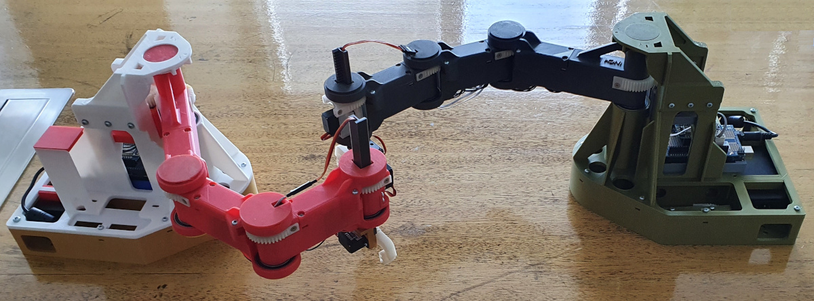

# Reinforcement Learning Algorithm for INCH6 Robot in Webots Simulation

This repository uses Reinforcement Learning algorithms to teach planar redundant robot to execute point-to-point movements.

## INCH6 Robot

The INCH6 robot is a SCARA-type planar redundant. It is simulated in the [Webots](https://cyberbotics.com/) environment. The robot is developed for research and educational purposes. It is developed and 3D printed.

## Reinforcement Learning

We are using the [official examples of the deepworlds framework](https://github.com/aidudezzz/deepworlds).

Two types of algorithms are adapted and evaluated:

- [Proximal Policy Optimization (PPO)](https://arxiv.org/abs/1707.06347) with discrete output space;
- [Deep Deterministic Policy Gradient (DDPG)](https://arxiv.org/abs/1509.02971) with continious output space.

The main goal is to teach the robot to execute point-to-point movement to an arbitrary position in the workspace. DDPG has continious output space and is expected to perform better than PPO.

The original implementation of the algorithms is taken from the [official examples of the deepworlds framework](https://github.com/aidudezzz/deepworlds).

The code is applied to the simulated planar redundant 3D printed robot INCH6.

## Experiment Results

For the conducted experiments the robot is expected to execute point-to-point movement to a specific target position in the workspace. The position of the target is not static. The position is randomly generated at the beggining of each training episode.

### PPO Results

The algorithm was executed with steps per episode set to 150.

For the first experiment, the stop condition was set to average score of the last 500 espisode higher than -3. PPO required 5074 episodes. This was the best average score and it did not improve further, even with 15 000 episodes.

Training process, convergence, and simple moving average of the last 500 episodes (SMA500):

YouTube video from the simulation after the training:

For the second experiment, the stop condition was set to average score of the last 500 espisode higher than -0.5 and the episodes were limited to 15 000. The PPO was not able to achieve the desired score within 15 000 episodes.

### DDPG Results

The algorithm was executed with steps per episode set to 150.

The DDPG process required 11 171 episodes in order to achieve average score of the last 500 episodes higher than -0.5.

Training process, convergence, and simple moving average of the last 500 episodes (SMA500):

YouTube video from the simulation after DDPG training:

## Summary

After the conducted experiments we can conclude that the DDPG agent outperfoms the PPO agent. This confirms the initial expectation.

## Disclaimer

The code for the PPO and DDPG agents is taken from the [deepbots-tutorials GitHub repository](https://github.com/aidudezzz/deepbots-tutorials). Special thanks for all of the contributors.
